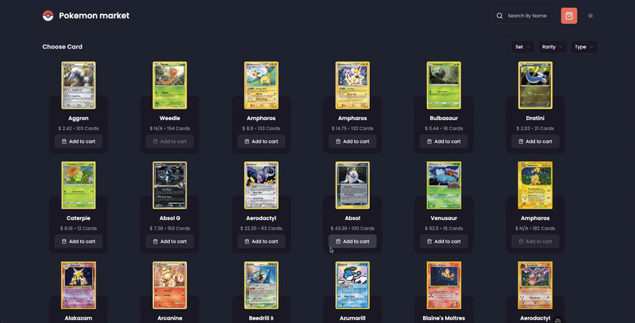
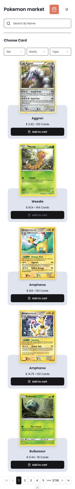
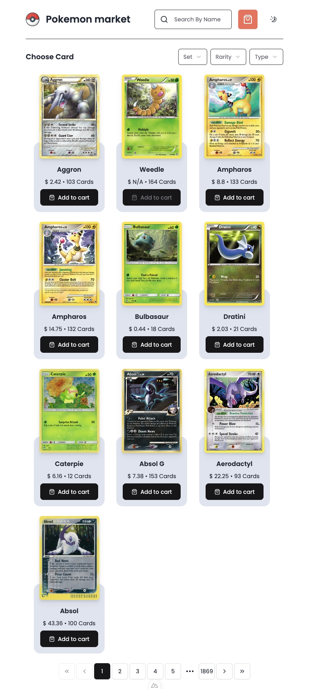
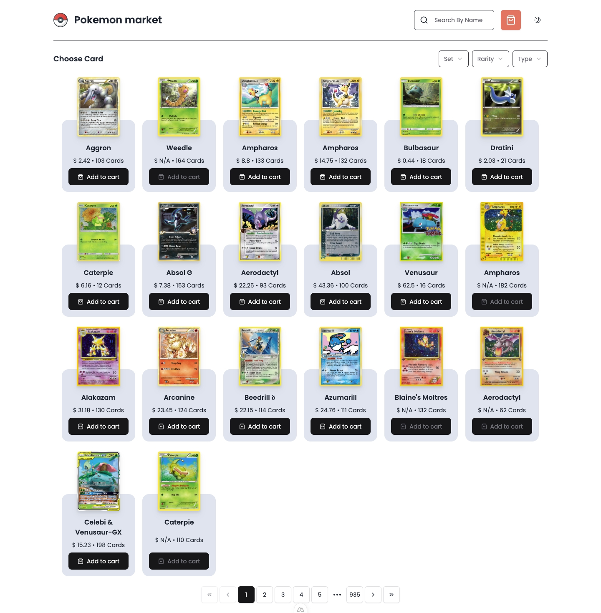
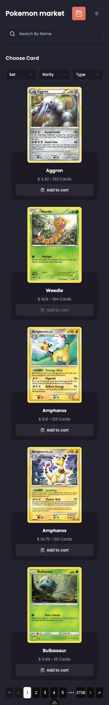
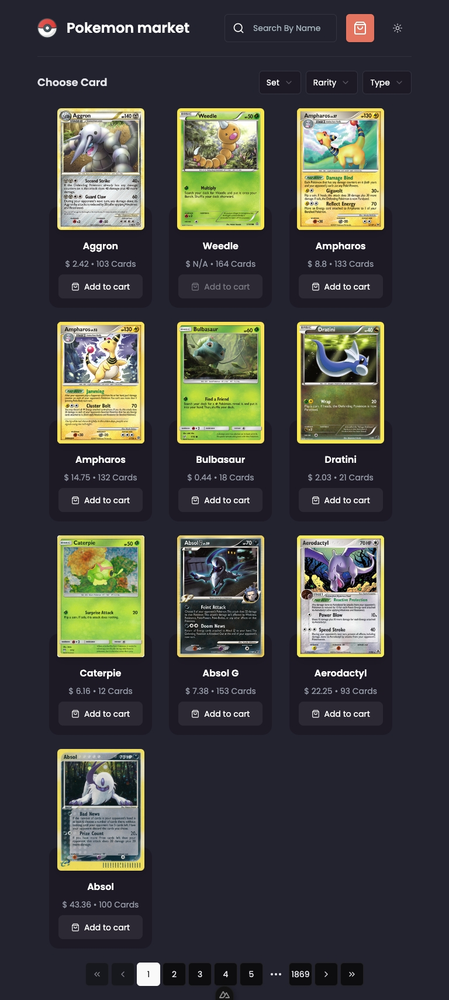
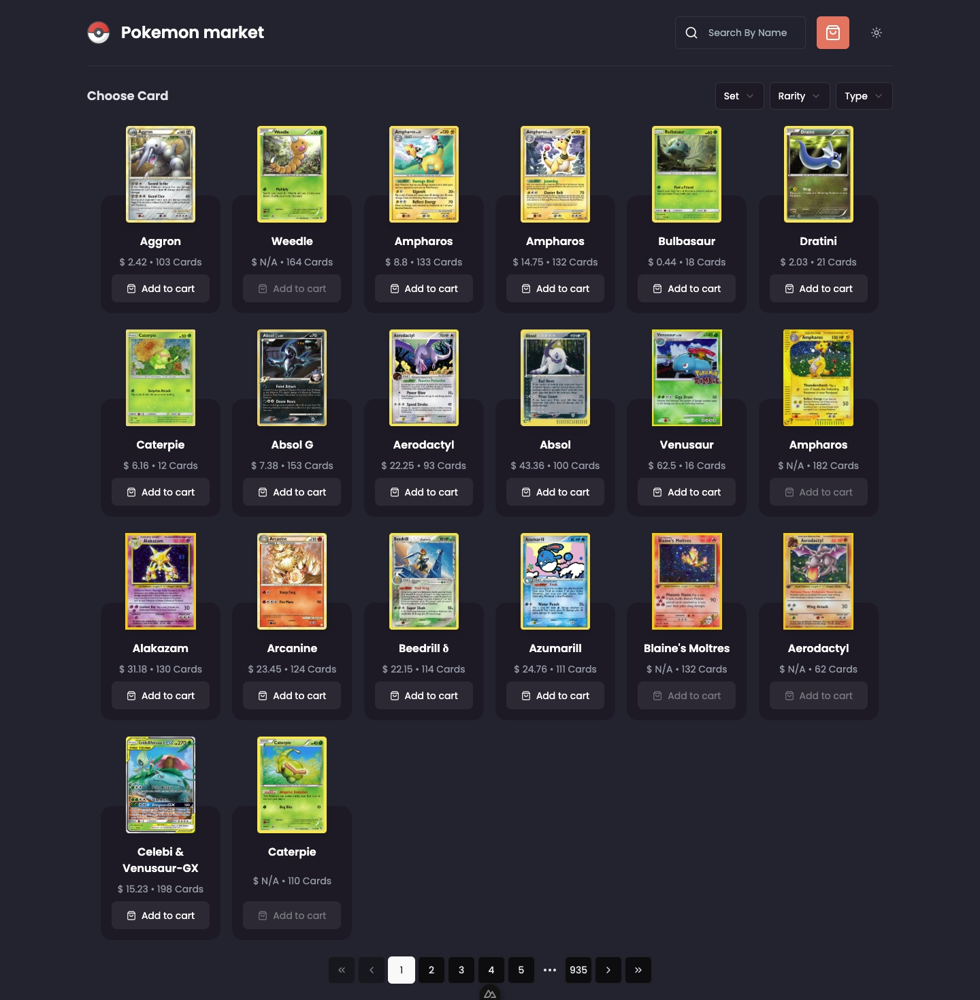
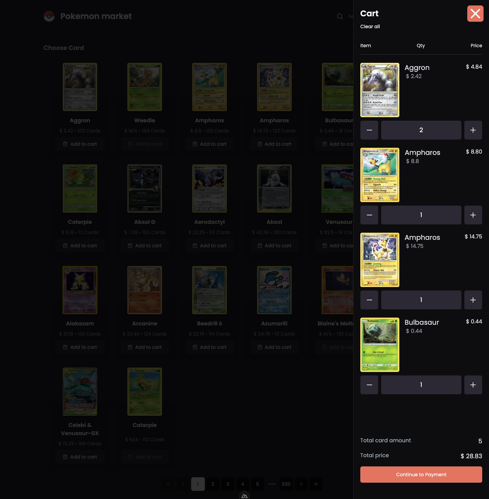

# Pokemon Card Market

- [Pokemon Card Market](#pokemon-card-market)
- [Tech Stack \& Features](#tech-stack--features)
- [Example](#example)
- [TODO](#todo)
- [Screenshot](#screenshot)
- [Source Pokemon TCG API](#source-pokemon-tcg-api)

# Tech Stack & Features

- Nuxt
- Pinia(State Management)
- UI/CSS
  - Tailwindcss
  - Shadcn-vue
- Theme switch Mode (Light, Dark, System)
- Code Quality
  - Eslint
  - Prettier
  - Lint-staged
  - Commitlint
  - Husky
- Pagination
- Filter(set, rarity, type)
- Search(debounced 2000ms)
- Screen detect page size (mobile=5, tablet=10, desktop=20)
- Cart

# Example

  

# TODO

- Add tag badge information below card
- Cache request like TanStack Query

# Screenshot

<table>
  <tr>
    <td align="center">
      
    </td>
    <td align="center">
      
    </td>
    <td align="center">
      
    </td>
  </tr>
  <tr>
    <td align="center">
      
    </td>
    <td align="center">
      
    </td>
    <td align="center">
      
    </td>
  </tr>
</table>

  

# Source Pokemon TCG API

[Pokémon TCG API Documentation](https://docs.pokemontcg.io/)
